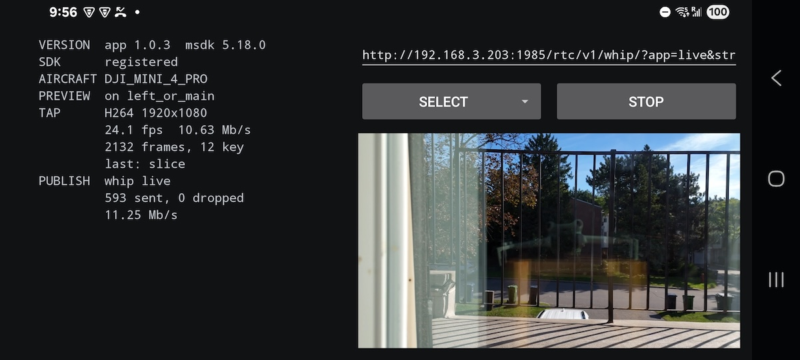
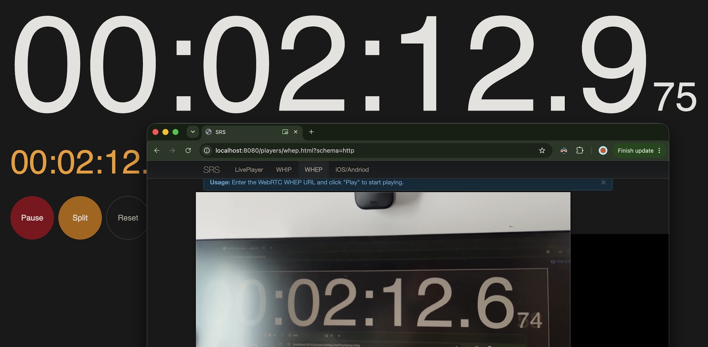
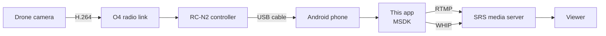
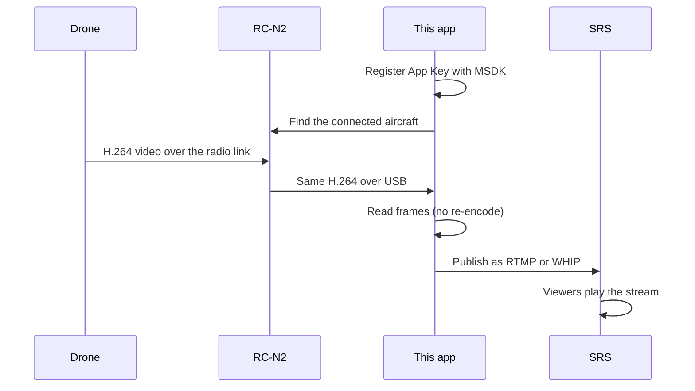

# SRS DJI Demo

An Android app that takes the live video from a DJI drone and publishes it to a media server as
**RTMP** or **WHIP**.

It uses the DJI Mobile SDK (MSDK) to read the H.264 video the drone already sends, so it works with
consumer drones like the Mini 4 Pro — not only enterprise models.



## Three ways to stream from a DJI drone

| | Approach | RTMP | WHIP | Works with DJI Fly |
|---|---|---|---|---|
| 1 | **DJI Fly / DJI Pilot 2** (official app) | All drones | Enterprise drones only | — |
| 2 | **This project** (your own MSDK app) | Yes | Yes | **No** |
| 3 | **Media server on the phone** (separate tool) | Yes | Yes | **Yes** |

**Approach 1** is the easiest: the official app can stream by itself, no code needed. But consumer
drones such as the Mini 4 Pro can only use RTMP. WHIP is limited to the enterprise series.

**Approach 2 is this project.** Instead of using the official app, you build your own app with the
MSDK. The app reads the H.264 video from the drone and sends it out as RTMP or WHIP. This gives
consumer drones WHIP, and the latency is low.

**Approach 3** keeps the official app. A small media server runs **on the same phone** as DJI Fly, so
DJI Fly just publishes RTMP to `localhost`. That local server then forwards the stream out to other
platforms — as WHIP or SRT, and to several destinations at once. Because nothing else has to touch
the USB cable, DJI Fly keeps working normally. This is a separate tool for iPhone and Android, still
in development.

## Latency

End to end, from the clock in front of the drone to the video in the browser, is about **300 ms**.

In the photo the real clock shows `2:12.9` and the WHEP player shows `2:12.6`.



## How it works

The drone already encodes H.264 for its own live view. This app does not re-encode it. It takes the
same stream and sends it to a server, so the phone does almost no work.



The steps:



1. The drone camera encodes H.264 and sends it down the O4 radio link.
2. The RC-N2 controller receives it and passes it to the phone over the USB cable.
3. The MSDK gives the app the H.264 frames.
4. The app packs the frames into RTMP or WHIP and sends them to the server.

**No third-party streaming library.** The protocols are all written from scratch in Kotlin in this
project, with AI: RTMP, and for WHIP the ICE, DTLS, SRTP and RTP parts. The MSDK is used only to get
the H.264 frames. Everything after that is this project's own code.

## Use it

You need an Android phone, a DJI remote controller that supports the MSDK, and a drone.

**1. Get a DJI App Key.** Register at <https://developer.dji.com> and request a key for your own
package name. A key only works for the package it was issued for, so you cannot use someone else's.

**2. Put the key in `local.properties`** (this file is never committed):

```properties
AIRCRAFT_API_KEY=your_key_here
PUBLISH_HOST=192.168.1.100
```

`PUBLISH_HOST` is the address of your media server. The phone must be able to reach it.

**3. Build and install:**

```bash
./gradlew assembleDebug
adb install -r app/build/outputs/apk/debug/app-debug.apk
```

**4. Start a media server.** [SRS](https://github.com/ossrs/srs) accepts both RTMP and WHIP:

```bash
cd srs/trunk && CANDIDATE=192.168.1.100 ./objs/srs -c conf/console.conf
```

`CANDIDATE` must be the address the phone will reach, or WHIP will not connect.

**5. Stream.** Connect the controller to the phone with the USB cable, power on the drone, open the
app, pick an RTMP or WHIP URL, and start streaming.

> Note: A valid App Key is required. Without it the app runs, but it cannot connect to the drone.

## Known limit: it cannot run together with DJI Fly

This app reads the video through the USB cable to the controller. DJI Fly uses the same cable. Only
one app can hold it, so **you cannot use DJI Fly and this app at the same time.**

While this app is streaming, you do not have the DJI Fly screen. For real flying you would need to
build the flight UI you need into your own app with the MSDK.

If you want to keep DJI Fly, use approach 3 instead: a media server runs on the same phone, DJI Fly
publishes RTMP to `localhost`, and that server forwards the stream out as WHIP or SRT.

## License

MIT. See [LICENSE](LICENSE).

